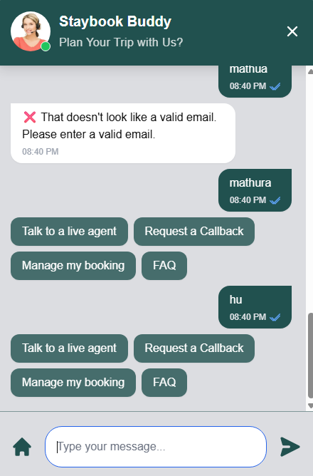
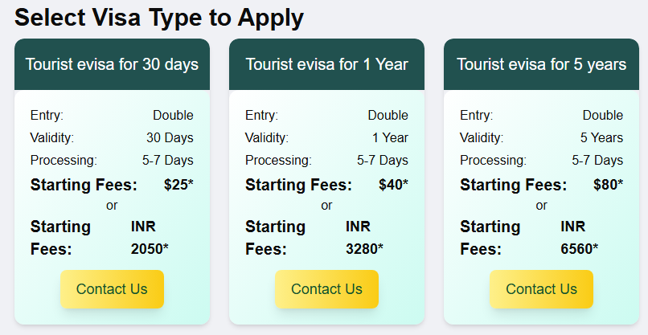
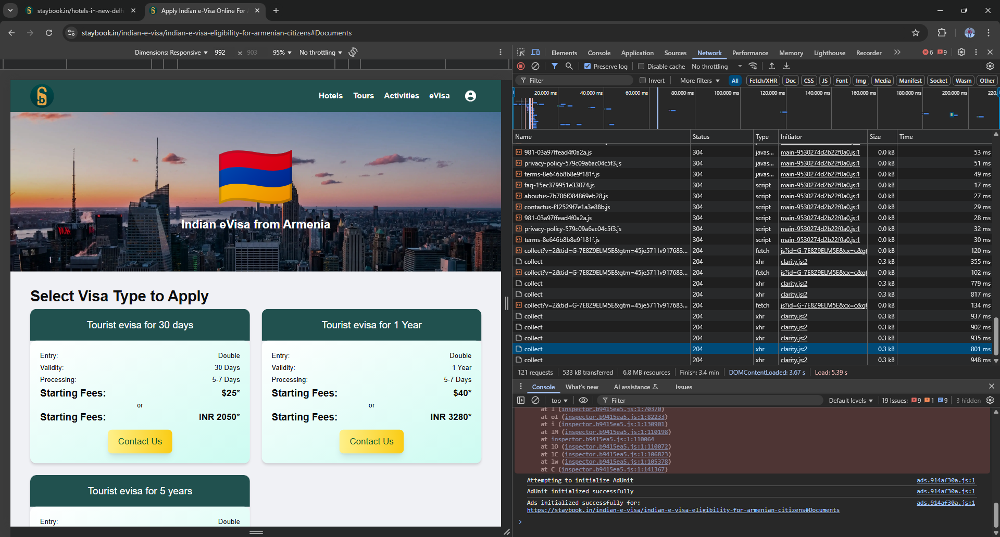
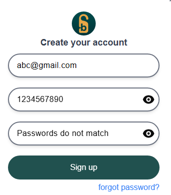
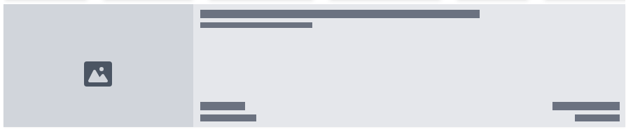
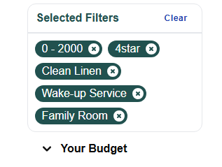
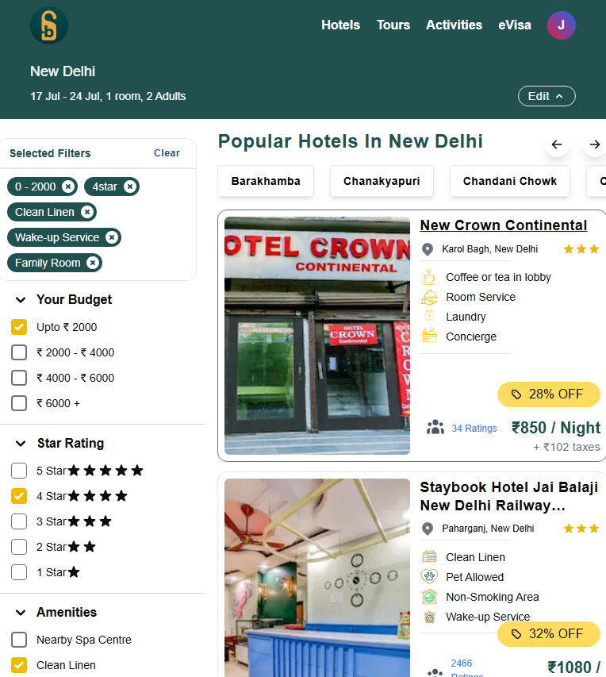
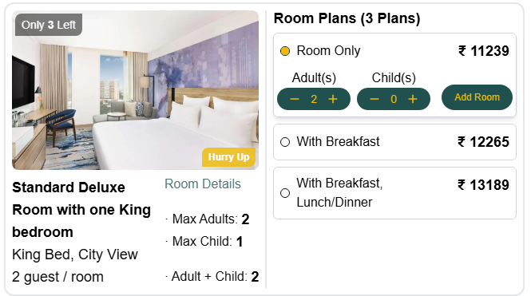
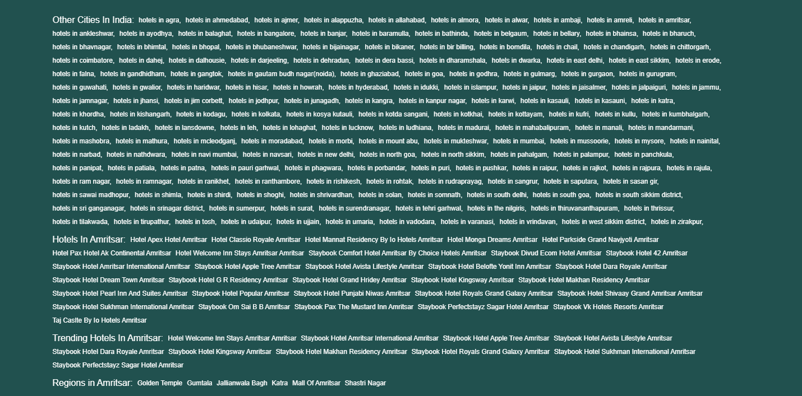
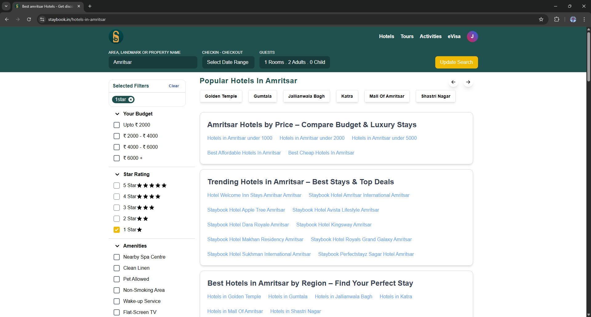

# StayBook

## Task: Booking Flow Bug & UX Audit

### 1) Chatbot

- Nowadays, users expect a more conversational GenAI-powered chatbot, but yours feels robotic.

Suggestions:

- Change "Plan Your Trip with Us?" to a friendly statement like "Let us help you plan your trip!"

- Update the chatbot's profile picture and give it a human-like name to increase engagement.

- Integrate a GenAI solution to make the interaction more natural and personalized.

### 2) eVisa Section – Spacing & UX

The spacing can be significantly improved.

- The prices in USD and INR should be bold, and the INR value can be styled using an icon or tag.

- Most users won't read long paragraphs; they'll just follow visual cues (as shown in the video).

<video controls src="./images/20250707-1550-16.1426639.mp4" title="Long Text"></video>

- Suggestions:

  - Break down long text into clear categories or sections.

  - Display relevant content even before the user initiates a search.

  - Improve font style and line spacing for readability.

- When selecting a country, images take time to load, making the site feel slow.

- Consider hosting images on Cloudinary or a similar CDN.

- Use Redis caching to store URLs and improve image-loading speed.

### 3) Network Logs

- Check the browser’s network tab to review how many requests your site is making.

- If \_collect or similar APIs are polling repeatedly, it unnecessarily increases your bandwidth cost.

- Replace polling with WebSockets for real-time updates.

- Reduce requests by replacing static assets (logos, icons, etc.) with inline SVGs for faster rendering.

### 4) Login Field Issue

- When a user enters the wrong password, the password field retains the text, which is poor UX.

- It forces the user to manually delete the input before trying again.

- The field should automatically clear on failure.

### 5) Hotel Loading Skeleton

- The current loading skeleton has sharp edges and feels harsh.

- Use rounded corners and softer colors to give a more premium and friendly appearance.

### 6) Filters

- Applied filters appear stacked and cramped in a small space, making the UI look cluttered.

- Redesign the filter UI to be cleaner and collapsible, so it doesn't overwhelm the user.

### 7) Responsiveness (Tablet View)

- On tablets, the layout lacks left and right padding, making the content look squished.

- The UI feels cluttered and dense, violating basic design principles.

- Add proper spacing to improve readability and comfort.

- Avoid overloading the screen with information — prioritize what's essential.

- For example, the "Room Details" section takes up unnecessary space.

- Instead, move that information into the title area or a collapsible section.

### 8) Search Box Behavior

<video controls src="./images/20250708-1628-30.5918105.mp4" title="Title"></video>

- When clicking inside the search box, the cursor appears at the beginning of pre-filled text.

- Ideally, the input should be empty on focus to reduce confusion and friction.

### 9) FAQ Section

<video controls src="./images/20250708-1710-01.0279569.mp4" title="Title"></video>

- The FAQ section currently looks like a textbook, which discourages users from engaging.

- Use accordion/dropdown elements to display answers in a simpler, interactive format.

- The layout is messy and inconsistent — clean up the alignment, spacing, and text styles.

### 10) Pop-ups

- Using alert() is not recommended for production apps:

- It's synchronous and blocking, freezing the UI until dismissed.

- No styling or customization is possible.

- Inconsistent behavior across browsers and devices.

- Poor modern UX — feels outdated and intrusive.

- Suggestion:
  Use custom-designed modals instead (e.g., with libraries like SweetAlert2, Bootstrap modals, or custom React components).

⭐ Additional Suggestions

Add a fun touch:

"We care about your experience — that's why we don’t recommend 1-star hotels 😊"
